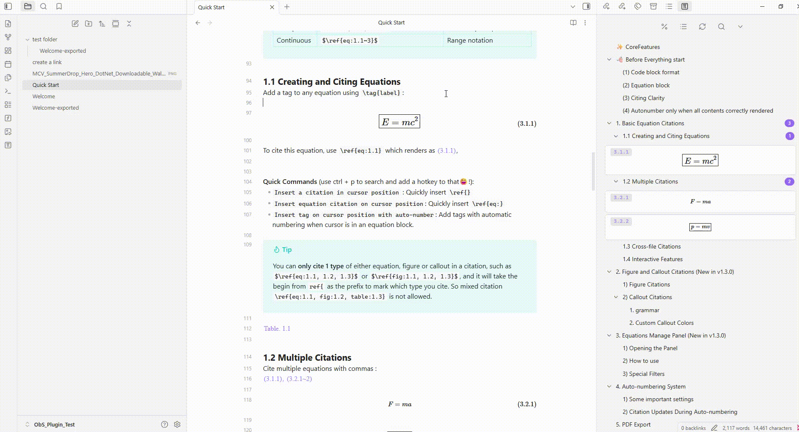
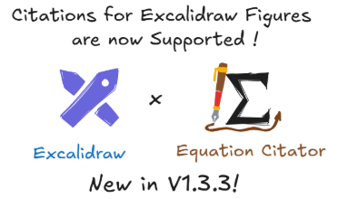
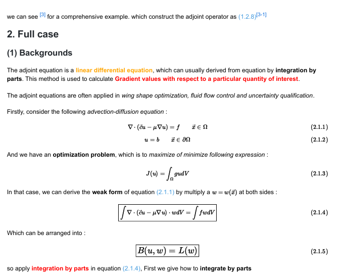

  

  
  
  
  
  

<b>English</b> | <a href="README_zh.md" target="_blank"><b>简体中文</b></a>

<h4>A Powerful, Convenient & Elegant Academic Tool for Citation</h4>

<b><h3>Thanks for 1.5k downloads😄!</h3></b>
 

---

🚀 **Quick Start**: See [Quick Start](https://github.com/FRIEDparrot/obsidian-equation-citator/blob/master/tutorials) for basic rules, syntax, and most important operations. It only takes < 5 mins but will make everything go smoothly.

✨ **Complete Features & Updates**: See [Changelog](https://github.com/FRIEDparrot/obsidian-equation-citator/blob/master/CHANGELOG.md) for details.

📹 **Video Tutorial**: Coming soon if this plugin has 5000 downloads or this repo gets 50 stars. 

📱 **Platform support**: This plugin has been tested on **Windows, Linux, Mac, and Android**. (It is primarily designed for Windows; Android support was added after v1.3.3, and some features — e.g., drag-and-drop citation and certain previews — may be limited on mobile.)

## 🛠️ Installation

1. You can download it from community plugins (`Settings` > `Community plugins` > `Browse` and search for `equation-citator`).

2. Or you can download `main.js`, `manifest.json` and `style.css` from the latest release page and place them in `.obsidian/plugins/equation-citator` in your Obsidian vault.

## 👋🏻 Applications & Usages

> [!note]
> **This plugin would be pretty useful if**:
> - You're writing academic notes in Obsidian and need to manage numerous equations, figures, and tables efficiently with automatic numbering and cross-references
> - You're drafting research papers or technical documents in Markdown and want LaTeX-style citation with accurate numbering
> - You derive equations in your notes and need to reference them throughout your derivation process or across multiple files
> - You use Obsidian for school or university notes and want quick navigation to cited content without endless scrolling
> - You have figures, tables, or theorem-like content in your notes that requires systematic referencing and organization

> [!warning]
> **This plugin is NOT designed for**:
> - Citing equations or content within PDF files (PDFs are not recognized or processed by the plugin)
> - Managing bibliographic references or literature citations (use a dedicated citation management plugin instead)
> - Real-time collaborative editing with automatic sync of equation numbers across users
> - Processing equations in image files or scanned documents

## ✨ What this plugin does

### 1. ⚡ Auto-number Equations & Figures by Heading Level

One-click auto-numbering support for:
- All equations / tagged equations only
- All figures / tagged figures only
- Full support for **auto-updating citation numbers** after auto-numbering — add or delete equations and figures anywhere without worrying about broken numbering or citations
- **Right-click to rename tags** for equations and figures, with all citations updated automatically

### 2. 🖼️ Cite Equations, Figures, Tables and Theorems

- Cite equations with `\ref{eq:tag}` syntax, with full autocomplete support
- Cite figures by adding a `fig:` field to the image and using `\ref{fig:tag}` syntax
- Cite tables and theorems callout citation with fully configurable prefixes.
- Support for **Excalidraw images** and **markdown section previews**
- Full support on **multiple citation & continuous citation & cross-file citation**

### 3. 🖥️ Equation Manage Panel — Browse, Jump and Cite by Drag and Drop

- Browse and cite **equations, figures, and callouts** by **drag and drop** from the manage panel
- **Filter and search**, filter boxed equations & tagged equations in panel. 
- **Drag-drop citations** with all-type, cross-file support
- **Right-click to copy** equations directly from the panel or editor popover
- **Jump to equations**, figures and callouts directly from the popover and Equation Manage Panel

<!-- PLACEHOLDER: gif of switching between equation / figure / callout view in the panel -->

### 4. 📜 PDF Export

Run the command `Make markdown copy to export PDF` to generate a properly formatted markdown file ready for PDF export, with:
- Correct citation and reference numbers throughout
- Configurable **citation colors**
- Optional **figure captions and descriptions** in the exported output

## 🛒 Compatibility with other plugins

The following plugins often used for math are tested to be compatible with `Equation Citator` — you can use them together without any problem.

1. [Excalidraw](https://github.com/zsviczian/obsidian-excalidraw-plugin) — Excalidraw is supported in figure citation preview after v1.3.3; cite an Excalidraw picture by adding a `fig` field to it just like a normal image.
2. [Typst Mate](https://github.com/azyarashi/obsidian-typst-mate) — supports Typst-style autonumber; enable via `Settings > Categorical > Others > Enable typst mode`.
3. [Latex Suite](https://github.com/artisticat1/obsidian-latex-suite) — works seamlessly with this plugin; highly recommended for writing long and complex equations quickly.
4. [Completr](https://github.com/tth05/obsidian-completr) — provides better auto-complete for LaTeX syntax.
5. [Quick Latex](https://github.com/joeyuping/quick_latex_obsidian) — provides features like auto-enlarge brackets.
6. [Better math in callouts & blockquotes](https://github.com/RyotaUshio/obsidian-math-in-callout) — use for better math rendering inside callouts.
7. [No More Flickering Inline Math](https://github.com/RyotaUshio/obsidian-inline-math)

## 🚨 Disclaimer

This plugin can edit and update files in your Obsidian vault.

Although it has been thoroughly tested on multiple versions and used daily on my own vault for several months without data loss, unexpected bugs may still occur — especially when new features are introduced.

To protect your data, I strongly recommend enabling the "File Recovery" core plugin (or keeping regular backups) before using this plugin.

While I cannot take responsibility for data loss caused by bugs or unexpected behavior, I take reports seriously and will investigate and fix any critical issues that cause data loss as quickly as possible.

## 🐛 Bug & Reports

If you encounter any bug, please **provide the following information** on the issue page:
1. A description of the bug or issue, along with steps to reproduce it.
2. The relevant markdown text that triggers the issue.
3. Enable debug mode in the settings tab and provide the console log (`Ctrl + Shift + I` in Obsidian).

If you have suggestions or questions for this plugin, feel free to leave them on the issue page.

> [!TIP]
> Since this plugin has a cache mechanism for better performance, a normal delay or a non-immediate update is expected cache-related behavior. Wait a few seconds, or re-open the file or restart Obsidian to confirm your issue is not just a cache delay.

## 💖 Support and Collaboration

I developed this plugin as a hobby and use it in my daily work. It's completely free for everyone to use.

- 💖 I would be very glad if anyone can help maintain this plugin (since I'm busy during school time).

> [!NOTE]
>
> **Contributors and maintainers are always welcome**:
> You can contribute by forking this repo and submitting a PR:
> 1. **Please test your code carefully before submitting a PR!**
> 2. Add what you have done to `CHANGELOG.md`. (Use the next patch version number if a new minor version is not planned.)
> 3. We have CI checks before merging — please make sure your code passes all checks.
>
> For submitting a PR, please commit to the `dev-latest` branch. This is the latest development branch, and I will always sync my dev branch to it to prevent potential merge conflicts.

Thanks to [@azyarashi](https://github.com/azyarashi) for collaboration and substantial improvements to the plugin. I also appreciate all the users who suggested useful new features and enhancements.

Finally, if you find this plugin helpful, consider buying me a cup of ☕️:

<a href='https://ko-fi.com/Z8Z81N7CMO' target='_blank'></img></a>
