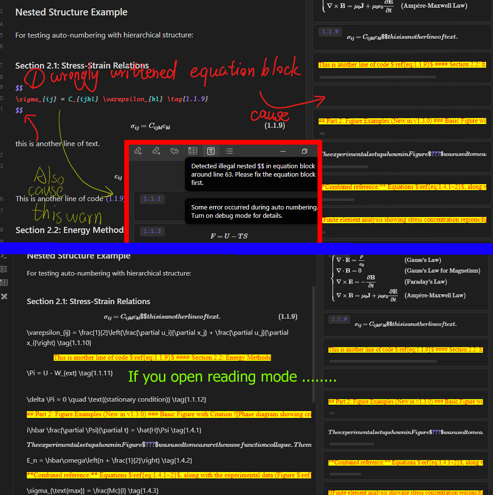

> 🚀 **Enable the plugin and copy this tutorial (along with the test files) to your vault to follow along interactively.**

The Equation Citator plugin transforms Obsidian into a powerful academic writing environment with LaTeX-style citations. Version 1.3.0 introduces the **Equations Management Panel** with drag-and-drop citation support, And also add features of  citation for figures, tables and more. Making academic referencing easier than ever. 

### ✨ Core Features (For v1.3.0 and Later)  
- **Equation Citations**: Tag and reference equations with `\tag{}` and `\ref{}` 
- **Auto-numbering**: Automatically number equations for easy-management 
- **Cross-file Citations**: Reference content across multiple documents
- **PDF Export**: Generate properly formatted documents for publishing
- **Figure & Table Citations** (New in v1.3.0): Cite images and tables with custom syntax   
- **Drag & Drop Citations** (New in v1.3.0): Drag equations from the management panel

## 👋🏻 Before Everything start 
There are some very simple writing guidelines you should follow : 
### (1) Code block format 
Always use 3 backticks for code block like following (other numbers are not recommended) :  
```latex
Code block 
```

### (2) Equation block  
1.  We only cite equation blocks, not cite inline equations. 
2. For a correct-written equation block,  **NOT WRITE ANY OTHER CONTENT IN THE  LINE OF EQUATION BLOCK**. e.g. :  

✅ CORRECT EXAMPLES :   
```latex
%1-line equation block format%  
$$ \Large \boxed{dg = - s dT+v dp } $$  

%multi-line equation block format%
$$
\Large \boxed{dg = - s dT+v dp }
$$

%or write equation freely in multi-line%
$$ du = \left(\frac{\partial u}{\partial s}\right)_v ds +\left( \frac{\partial u}{\partial v}\right)_s dv \rightarrow
\quad \boxed{T = \left( \frac{\partial u}{\partial s}\right)_v, \quad p = - \left(\frac{\partial u}{\partial v} \right)_s} \tag{3.1.1} $$
```

❌ NOT SUPPORTED EXAMPLES :

```latex
this  is an $$ equation
$$ block  # not write content before or after equation block in one line!
```

**Q : Why we don't support this**? 

A : Deliberately writing text after equation block can cause equation render problem in reading mode (also cause issue in our auto-number). In that case, we will stop auto-number and give you a warning. You can open reading mode to check where this problem is.



If you still don't understand, goto [bug #74](https://github.com/FRIEDparrot/obsidian-equation-citator/issues/74) for clarification.

### (3) Citing Clarity  
1. Avoid using `\}` in your tag or citation (this will cause the tag recognized incorrectly) 
2. Use number (1,2,3,.... ) for footnotes, not use characters. 
3.  To **cite a callout** after v1.3 :   
You can **select content and use command `insert callout` to quickly make content a callout**. For these callout **Every line should start with greater sign** `>`. Implicit callout line with no `>` sign would be neglected. 

### (4) Autonumber only when all contents correctly rendered 

You should autonumber all equations of file **Only when all contents correctly rendered and your markdown syntax is correct**. 

```markdown
$$
\text{equation content} 
# malicious heading 
\text{other content}
$$
```

This will cause heading dismatch in Auto-numbering, and `# title` grammar is prohibit in equations (in that case equation render incorrectly). So only auto-nuber when all your content are correctly rendered. 

> [!warning] 
> You should follow above rules if you use this plugin. Issues caused by not following above rules may be closed without being fixed. 

## 1. Basic Equation Citations 

The citation syntax are summarized as following table,  if you think these are very simple, you can jump to [[#3. Equations Manage Panel (New in v1.3.0)|Manage Panel Tutorial]] directly. 

> [!summary] Citation Syntax Table of below
> | Feature       | Syntax                                  | Example                        |
> | ------------- | --------------------------------------- | ------------------------------ |
> | Equation Tag  | `\tag{label}`                           | `\tag{2.1}`                    |
> | Equation Cite | `$\ref{eq:label}$`                      | `$\ref{eq:2.1}$`               |
> | Figure        | `` | `` |
> | Table         | `> [!table:label] Title`                | `> [!table:3.1] Results`       |
> | Cross-file    | `$\ref{eq:footnote^{label}}$`           | `$\ref{eq:1^{2.3}}$`           |
> | Multiple      | `$\ref{eq:1.1, 2.1}$`               |  cite multiple equations |
> | Continuous    | `$\ref{eq:1.1~3}$`                      | Range notation                 |

### 1.1 Creating and Citing Equations 
Add a tag to any equation using `\tag{label}`: 
$$
\Large\boxed{E = mc^2} \tag{1.1}
$$

To cite this equation, use `\ref{eq:1.1}` which renders as: $\ref{eq:1.1}$

**Quick Commands** (use ctrl + p to search and add a hotkey to that😄!):  
- `Insert a citation in cursor position` : Quickly insert `\ref{}`
- `Insert equation citation on cursor position`: Quickly insert `\ref{eq:}`
- `Insert tag on cursor position with auto-number`: Add tags with automatic numbering when cursor is in an equation block.  

> [!tip]  
> You can **only cite 1 type** of either  equation, figure or callout in a citation, such as `$\ref{eq:1.1, 1.2, 1.3}$` or `$\ref{fig:1.1, 1.2, 1.3}$`,  and it will take the begin from `ref{` as the prefix to mark which type you cite. So mixed citation `\ref{eq:1.1, fig:1.2, table:1.3}` is not allowed.  

### 1.2 Multiple Citations
Cite multiple equations with commas: $\ref{eq:1.1, 1.2, 1.3}$ 
$$\boxed{F = ma} \tag{1.2}$$
$$\boxed{p = mv} \tag{1.3}$$

**Continuous Citations**: Enable in settings to render `$\ref{eq:1.1, 1.2, 1.3}$` as $\ref{eq:1.1~3}$ 

### 1.3 Cross-file Citations  

The cross-file citation **relies on the built-in footnote system of obsidian** : so you can create footnote using following syntax :  

```markdown
[^1]: [[Document_A|Paper A]]
[^2]: [[Document_B|Report B]]
```

The syntax is: `$\ref{eq:footnote^{tag}}$`,  For example,  As shown in equation $\ref{eq:1^{2.3.1}}$ from Paper A[^1]. 

### 1.4 Interactive Features 
- **Preview**: Hold `Ctrl` and hover over any citation to preview the equation
- **Jump to Equation**: `Double-click` any equation preview to jump to its equation
- **Open in Split**: `Ctrl + Double-click` opens the equation in an adjacent panel
- **Rename Tags**: Right-click on any `\tag{}` to rename it (all citations update automatically)

## 2. Figure and Callout Citations (New in v1.3.0) 
### 1) Figure Citations 
We use the enhanced image syntax to make figures citable : 

```markdown
%%wiki link format%%
![[James_Lovell.jpg|fig:3.1|desc:description]]

%%web link format%%
 
```

This plugin only support cite locale image files, not support citing web link images and excalidraw.  

![[test_image.png|fig:1.3|title:minecraft|desc:a test minecraft picture|200]]

This will create :
- A figure with label `fig:1.3`
- A caption displayed below the image
- A description for extended context 

We can use $\ref{fig:1.3}$ to cite this **figure** 

> [!HINT] 
> Some additional features like auto-number and auto-complete are not currently supported for figure and callout reference. 

### 2) Callout Citations 
#### 1. grammar
The plugin support citing callouts with customized types, **this give us flexibility to cite tables, theorems and any customized pieces**.  

You can configure customized prefix in `Callout/Quote Citation Prefixes` settings, by default `table:` are enabled

So here we give an example  for how to cite a table : 

> [!table:2.1] Sales Data Q4 2024 
> | Product | Revenue | Growth |
> |---------|---------|--------|
> | Widget A | $100K | +15% |
> | Widget B | $150K | +22% |

Cite the table using: `$\ref{table:2.1}$`, rendered as $\ref{table:2.1}$  

**NOTE: We don't support render image in callout and cite it currently. So please not use images in callout.**

#### 2. How to edit table in callout

Since **edit table in callout would not be easy**, here I give a simple trick to you to edit table easier (also see [feature #7](https://github.com/FRIEDparrot/obsidian-equation-citator/issues/7)):   
1. When you want to edit table, use `Ctrl + shift` and drag the cursor vertically to duplicate cursor to the whole line and delete the quote mark `>`. (then you can edit the table as it is) 
2. After editing, insert a callout (I use `ctrl+Q` for this) around the table (this adds `>`) to all lines) and then combine two pieces together 

Also, callout citation should be strictly matched (including case match), e.g. `> [!NOTE:1]` should be cite with `$\ref:{NOTE:1}$` 

All figure and callout citations support syntax and interactive features in [[#1. Basic Equation Citations]]. 

#### 3. Custome Callout Colors

We also support customize callout colors by adding [callout.css](https://gist.github.com/LucasOe/0bed268951b90e897002ee1e31479c9c) to `Settings > Apperance > CSS Snippets`, so you a beautiful callout like this (this take effect after adding this snippet):

> [!table:1.1|red] Sales Data Q4 2024
> 
> This is a red callout table 
>  
> | Product | Revenue | Growth |
> |---------|---------|--------|
> | Widget A | 00K | +15% |
> | Widget B | 150K | +22% |
> | Widget C | 200K | +33% |

Unfortunately, we don't support customize icon for callout yet. Since it use icon as `data-callout`. And we also use first field as citation label.

## 3. Equations Manage Panel (New in v1.3.0)

### 1) Opening the Panel  
You can open the equation mange panel by : 
- Command palette: `Open Equations Manage Panel`
- Toolbar icon (if enabled) 

### 2) How to use  
Equation Manage panel is one of the most powerful feature of v1.3.0 :
1. **Drag** the item from the panel, **Drop** it into your text where you want the citation (Cross file drag will automatically create footnote for citation)  
2. The properly formatted `\ref{}` citation is automatically inserted!

This panel allows you to check and search equation very fast, **No need to scroll or remember syntax or equation numbers!** 

## 4. Auto-numbering System  
Use the command `Auto-number current file equations` or the toolbar button can automatically number all equations in current file based on heading level. 
### 1) Some important settings 

**Numbering Methods:**
- **Relative**: Numbers based on relative  heading hierarchy (2.1.1, 2.1.2, etc.)
- **Absolute**: Auto-number using the absolute heading level (1.1, 1.2 for #, etc.) 

**Numbering depth (1-6)** : controls the max level to auto-number `(1.1), (1.1.1)`  

### 2) Citation Updates During Auto-numbering 
When auto-numbering runs, all citations are automatically updated to match new numbers. This allows you insert an  equation any where  

## 5. PDF Export 

You need to run `Make markdown copy to export PDF` to export a markdown to ensure the styles are exported correctly.  

Note images may not centered after export, so I recommend you to add a simple snippet  (https://www.youtube.com/watch?v=ngcocqUPiE8), or just download a theme with image centered like `Blue Topaz`

## 6. Beta Features 

Citations will failed to render in callout part. Since its a built-in problem for obsidian, we won't fully supported write citations in callouts (Including not auto-update and not auto export). So I strongly recommend you not to use this Feature. 

--------- 

Congrats 🎉! You are all ready to use this plugin😄 !

*Created for Equation Citator v1.3.0 - For updates and issues, visit the [GitHub repository](https://github.com/FRIEDparrot/obsidian-equation-citator)* 
